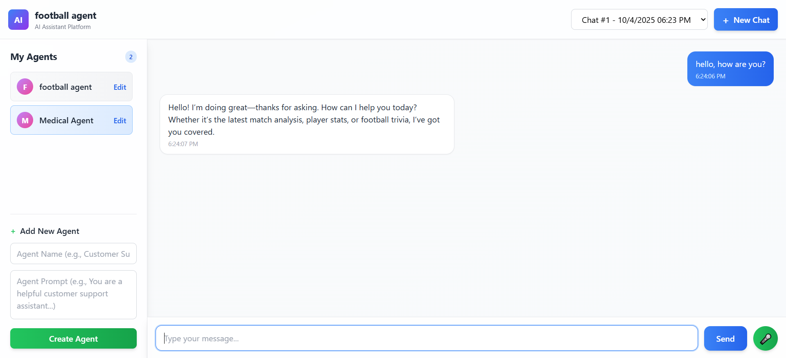

# Agent Platform Project

## Introduction
This is a Django-based agent platform that provides a comprehensive API for managing AI agents, chat sessions, and message handling. The platform supports both text and voice interactions, with a modular architecture that allows for easy extension and customization.

## Project Structure
```
├── api_core/            # Django project core (settings, urls, wsgi, asgi)
├── app/                 # Main Django application
│   ├── models/             # Database models
│   ├── serializers/        # API serializers
│   ├── services/           # Business logic
│   ├── views/              # API endpoints
│   ├── tests/              # Test cases
│   └── migrations/         # Django migrations
├── config/                          # Config management
├── deployment/                      # Deployment files (Docker, entrypoints)
├── manage.py                        # Django management script
├── requirements.txt                 # Python dependencies
├── readme.MD                        # Project documentation
└── Agent Platform Complete API.json # Postman collection
```

## Frontend Overview


## API Documentation
The project uses drf-yasg (Django REST Swagger Generator) for API documentation. After starting the server, you can access the API documentation through:

- Swagger UI: http://{{base_url}}/swagger/
- ReDoc UI: http://{{base_url}}/redoc/
- Raw schema: http://{{base_url}}/swagger.json or http://{{base_url}}/swagger.yaml

The documentation provides detailed information about:
- Available endpoints
- Request/response schemas
- Authentication methods
- API operations

## Postman Collection
A Postman collection is available in the "Agent Platform Complete API" json file. You can import this file into Postman to test the API endpoints directly.

## Database Models

### Agent
- Represents an AI agent in the system
- Stores agent configurations and properties

### ChatSession
- Manages chat sessions between users and agents
- Tracks session state and metadata

### Message
- Stores communication history
- Supports both text and voice messages

## Setup Instructions

### Prerequisites
- Python 3.12+ (conda is preferred)
- pip
- PostgreSQL
- Docker (optional for deployment only)

### Local Development Setup
1. Clone the repository:
```bash
git clone https://github.com/osamaoun97/ai-agent-platform.git
cd ai-agent-platform
```

2. Create and activate virtual environment:
```bash
conda create -n agent_platform python=3.12
conda activate agent_platform
```

3. Install dependencies:
```bash
pip install -r requirements.txt
```

4. Configure environment variables:
configure the `.env` file in the configuration manager with the required settings to connect to the db and openai, including:
```
OPENAI_API_KEY=your_openai_api_key
```
* Note: When using Docker, the database host should be db (service name in docker-compose) and localhost when working on local development.


5. Run migrations:
```bash
python manage.py migrate
```

6. Start the development server on the required port (default is 8000):
```bash
python manage.py runserver <port>
```

### Docker Setup
1. Build and run using docker-compose:
```bash
cd deployment
docker-compose up --build
```
The API will be available at http://localhost:8000, to change the port, modify the `docker-compose.yml` file and entry point script.

## Running Tests
The project uses Django's test framework. To run tests:

```bash
# Run all tests
python manage.py test
```